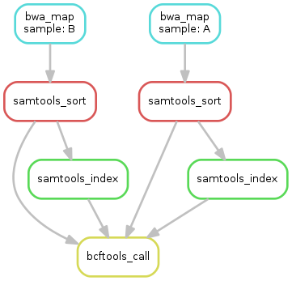

# Parallel Computing - A tutorial on how to spam the Orion compute cluster

> Orion is the High Performance Computing (HPC) at the Norwegian University of Life Sciences (NMBU)

This is a hands-on tutorial that introducing users of Orion to some techniques to run their scripts in parallel.

Overview: 

* Short intro
* SLURM array jobs (exercise 1)
* Software with built-in parallelism and etc..
* Parallel execution in bash scripts (exercise 2)
* Parallel execution in R (exercise 3)
* About workflow managers (snakemake/nextflow) and how they facilitate parallel execution

## Setting up for the workshop

It is recommended to clone this repo to somewhere in your home directory on Orion. This can be done in RStudio on Orion by creating a new project from git repo:

1. open Jupyterhub (there is a  link in the Orion Wiki) and launch Rstudio (whatever version)
2. In RStudio: File -> New project -> Version Control -> Git -> Paste repo URL (at github click the green **Code** button which will give you the URL. Use the HTTPS URL)

## 1. Intro

### The problem

The computer is taking too long to process the data!

Most programs run in serial, i.e. it is running one instruction at a time on a single core. So even if you run it on a compute cluster with thousands of cores it will not finish any faster (see Figure 1). To speed things up we need to run the program in parallel across multiple cores. 

>
>
>**Figure 1: poorly utilized cores**


### Some vocabulary

* **CPU** - Central Processing Unit a.k.a. the processor. Can refer to the physical chip which contain multiple **cores**, but is also used to refer to a single core.
* **core** - A single processing unit within a CPU. Can run a single program (thread) at a time.
* **process** - An instance of a active program. Typically has a single thread.
* **thread** - A process can seperate its execution into multiple threads that can run in parallel on multiple cores. Threads have shared memory which makes communication between threads easy.

* **Hyper-threading:tm:** - An intel technology that makes it look like the CPU has twice as many cores.


## 2. Array jobs

If you need to perform the same task multiple times but with different data and the order of execution is irrelevant, then you can submit an **Array job** on SLURM using `sbatch --array=indexes`.

When submitting an array job, SLURM will execute your script as many times the number of `indexes` you provide (`indexes` being a set of numbers that identify each individual job). The individual jobs will be distributed across the cluster, i.e. they may end up running on different nodes.

It is possible to limit the number of jobs running at the same time. This is important if you have a large array with thousands of jobs, as it would otherwise allocate all the cores on the cluster (which is a nuisance for the other users). 

### Exercise 1

> Exercise 1: Go to the [exercise1](exercise1/) directory


## 3. About software with built-in parallel functionality 

Most respectable bioinformatic tools have the ability to run in parallel. You can check their help to see if there is an option to run in parallel. Different tools use different names for their option, e.g:

```bash
samtools sort --threads
pigz --processes
Trinity --CPU
```

Although they use different terms is usually means the same.

### Multi-threading vs multiple processes

There are two different ways for a program to run in parallel, either it can start more processes or it can start more threads within the process. You can see this if you inspect the running processes with `top` as it will by default show one entry per process, multi-threaded applications can show more than 100% CPU usage. Threads are typically more efficient as they are faster to spawn and share the same resources as the parent process.

### MPI (OpenMPI)

Some programs require MPI to run in parallel. MPI stands for Message Passing Interface and is a protocol used by parallel programs to communicate between the different processes. OpenMPI is an open-source implementation of MPI which is available on Orion.

Here is an example of a sbatch script for running an MPI program on 4 processes:
```
#!/bin/bash
#SBATCH --ntasks 4

module load OpenMPI

mpirun <someMPIenabledProgram>
```

The `mpirun` command will launch 4 processes (it is somehow aware of the allocated resources in SLURM). And assign them with different "ranks", i.e. ID number of the processes. The program should then be able to use the MPI api to divide the labour between the processes.

MPI programs can (in theory..) execute across several nodes.

### Efficiency of parallel software may vary

Some algorithms/tasks are more difficult parallelize than other. Even though software has the option to run in parallel it doesn't mean that it runs in parallel the whole time. Typically there will be some parts that don't run in parallel and there will be diminishing returns on increasing the number of cores to use. 

### Memory/cpu balance

Be aware of the memory usage when running many jobs concurrently as the nodes might run out of memory before running out of available cores. When you run a program in parallel in separate processes like in an array job, each task will require memory, software that uses multi-threading can share memory and therefore use less total.


## 4. Parallel execution in bash scripts

In some cases you may want to start multiple process to run in parallel from a bash script. There are several ways to achieve this:

### The & operator and wait command

The `&` operator is used to run a command in the background. As opposed to normal execution, where the script will wait until each command is finished before continuing, the scipt will continue and allow you to run more processes in parallel.

For example if you want to zip two files in background:

```bash
gzip bigfile1 & gzip bigfile2 &
```

This can be used in a loop. Here is an example that executes a command on all the files in a folder:

```bash
indir="/path/to/some/files"
for filename in $indir/*
do
    somecommand $filename &
done

# wait for all the background processes to finish
wait

echo All done!
```

The `wait` comand is used to wait for all sub-processes that are running in the background.

### parallel

The `parallel` command, as the name implies, is used to run commands in parallel.

> Note: `parallel` is not installed by default but is available as a module on Orion (`module load parallel`). 

Example that runs some command for each file in a directory with at most two in parallel:
```bash
module load parallel

indir="/path/to/some/files"
ls $indir | parallel -P 2 someCommand $indir/{}
```

* The `-P 2` argument defines how many processes to run in parallel 
* The `{}` is replaced with one line from the `stdin`, which in this case is a filename from the `ls $indir`

### xargs -P

The `xargs` command is used to execute a command several times with arguments taken from `stdin` or a file. It would normally do it in series but with the `-P` option you can specify how many you would like to run in parallel.

```bash
indir="/path/to/some/files"
ls $indir | xargs -d "\n" -P 2 -i someCommand {}
```

* The `-d "\n"` argument tells it to use newline (`\n`) as delimiter, i.e. read one line at a time. Otherwise it would split on spaces as well.
* The `-i` option tells it to use `{}` as the replacement indicator allowing more flexibility in forming the command arguments, otherwise it would have just been added as the last argument of the command

`xargs` is a perhaps a bit more complicated to use than `parallel` but has the advantage that it comes preinstalled with linux.

### Exercise 2

> Exercise 2: Go to the [exercise2](exercise2/) directory


## 5. Parallel execution in R

If you do a lot of heavy computation in R then it can be helpful to speed it up by running it in parallel on the Orion cluster. Here we will look at a some ways of achieving this.

### mclapply

`mclapply()` is the "multi-core" version of `lapply()`. If you are familiar with `lapply()` then this is probably the easiest way to execute in parallel. You just need to specify the number of cores to use with the parameter `mc.cores`.

The following example runs the function `myfunction()` 100 times using 4 cores (i.e. 25 times each):
```
library(parallel)

results <- mclapply(1:100, myfunction, mc.cores = 4)
```

Under the hood `mclapply()` uses "fork" to make duplicates of the parent process. This has the advantage that all the loaded data and libraries are available to the called function.

> Note: Because it uses "fork", `mclapply` does not work on windows. If you try it would just work like a normal `lapply`


### Socket cluster with parLapply

Another function in the `parallel` library is `parLapply()`. This method requires you to first start up the parallel worker processes first with the `makeCluster()` function. While it is possible to use forking to start the processes, the default is to start them as new R processes. Communication with the worker processes is performed over the network interface ("socket" refers to network socket).

Example:
```r
library(parallel)

cl <- makeCluster(4)

results <- parLapply(cl,1:10,myfunction)

stopCluster(cl)
```

* `makeCluster()` starts new processes that wait for commands.
* `stopCluster()` to stop these processes.

The worker processes do not inherit the data or loaded libraries, so "export" of data to the worksers has to be done explicitly using the functions:

* `clusterExport()` Copy data to all workers
* `clusterEvalQ()` Evaluate expression on each worker once. E.g. to load libraries on the workers.


### foreach %dopar%

The `foreach` package offers a different way to do loops that is somewhere between `for` loops and `lapply`. But more importantly in our case, it can run in parallel. Unlike the `parallel` library that comes with the base installation of R, you have to install the packages `foreach` and `doParallel` first.

Example that runs a foreach loop on 4 cores in prallel:
```r
install.packages(c("foreach","doParallel"))
library(foreach)
library(doParallel)

registerDoParallel(4)

result <- foreach(i=1:10) %dopar% {
  # do stuff here
}

```

`foreach()` will automatically detect variables to export to the workers. Libraries will not be loaded automatically, but you can specify which to load on the workers with the `.packages` argument.

The `doParallel` package is is a so-called "backend" for the `foreach` that uses the `parallel` package under the hood. The `registerDoParallel()` can either take a cluster definition created with `makeCluster()` or just the number of cores. If you just specify the number of cores it will use "fork" if available (i.e. if not Windows).

There are other backends available, e.g. doMPI or doFuture.

### Some other relevant packages:

* The `future` package and friends (see https://www.futureverse.org/). High level interface for parallel execution in R. Supports many different backends.
* `BiocParallel` implements `bplapply()` and similar and is used by many bioconductor packages. Supports many different backends.


### Executing R scripts on the commandline

To execute an R script from the commandline you need to first load the R module and then use the `Rscript` command. Example: 

```shell
module load R/4.0.4

Rscript my_script.R
```

> It is a good idea to use the same version of R that you use in Rstudio. That way the same packages should be available on the commandline as in RStudio.

### Reading $SLURM_NTASKS in R

When executing in parallel you need to specify the number of cores to use. This should be equal to the number of cores allocated in SLURM, e.g. with the `sbatch --ntasks` argument. To read environment variables in R use `Sys.getenv()`.

Example that reads the `$SLURM_NTASKS` environment variable, with default value 1 if not set:
```r
numCores <- as.integer(Sys.getenv("SLURM_NTASKS",unset = 1))
```

### Exercise 3

The script `calcPI.R` contains an algorithm for estimating PI (not very efficiently). Use what you have learned to make it run in parallel.

* Modify the R script to run in parallel using one of the methods mentioned.
* Make it so that it takes the number of cores from the SLURM_NTASKS environment variable
* Create a sbatch job script that launches the R script
* Try submitting it with different number of `--ntasks` e.g. 2, 4 and 6
* Check the logs to see how long it took each time


## 6. Short note about workflow managers (e.g. nextflow/snakemake)

So far we have mentioned how to run a single program/script in parallel. This might be enough for simple tasks but in most cases you want to run your data through several programs. This is refered to as a workflow or pipeline.

The different programs in your workflow may have different resource requirements, i.e. different number of cores or amount of memory. Each program should therefore have their own SLURM job to allocate the correct resources. The best way to run such a workflow is to use a workflow manager such as snakemake or nextflow.

### Workflows allow implicit parallelism

Most scripts are inherently serial, i.e. they consist of a list of instructions that are executed one at a time, from top to bottom. Workflow structure is different. It is defined by the input and output of the tasks, i.e. the order of execution is arbitrary as long as the upstream tasks are performed first. This results in a directed acyclic graph structure with multiple paths that can be executed in parallel. E.g.:

>
>
>**Example of a simple workflow graph**

Workflow managers will run tasks in parallel when possible.

### Cluster configuring

Workflow managers do not automatically utilize slurm to submit jobs. Typically they will by default run the jobs locally using a specificied number of cores. To enable slurm they need to be configured.

#### Example nextflow slurm config

```plaintext
process {
    executor='slurm'
}

executor {
  queueSize = 10
  submitRateLimit = '10 sec'
}
```

#### Snakemake slurm config

It is recommended to setup a snakemake slurm "profile". See https://github.com/Snakemake-Profiles/slurm 

When you have set up the profile you can use it by running snakemake with the `--profile slurm` argument.

